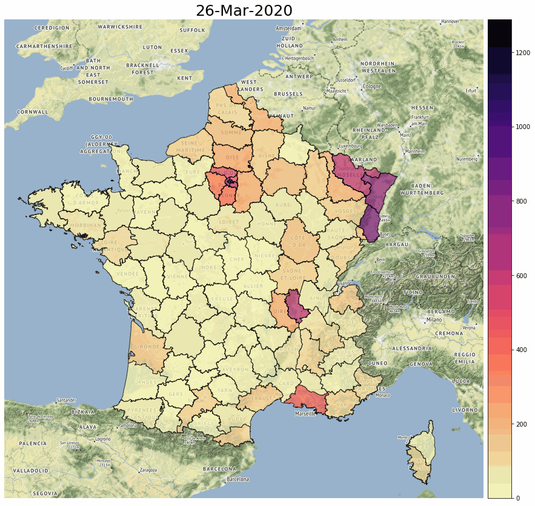
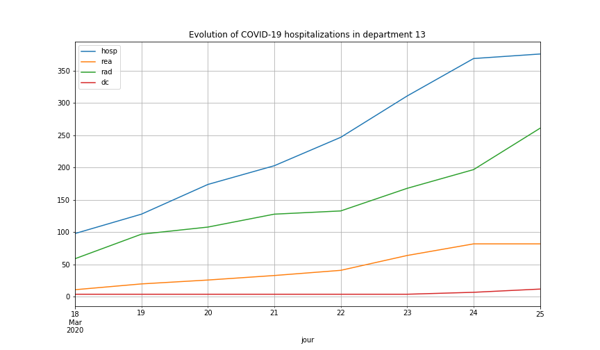
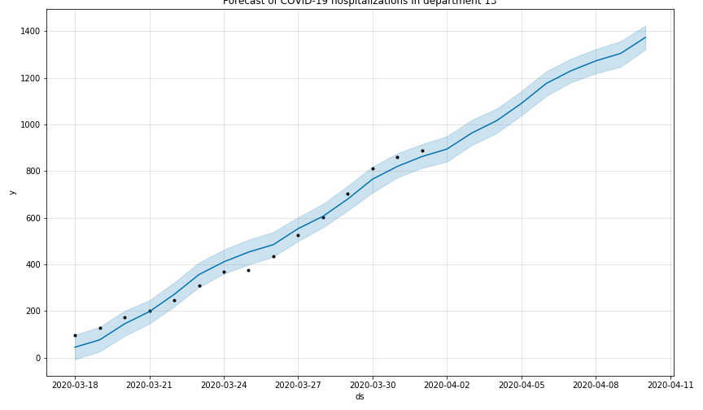

# COVID-19 forecast in French departments

Visualize a forecast (linear growth by department) of the evolution of the COVID-19 hospitalizations in French departments

COVID-19 and geographical data come from the [French open data portal](https://www.data.gouv.fr/fr/)

Data are stored as [pandas](https://pandas.pydata.org/) / [GeoPandas](http://geopandas.org/) dataframes

Forecast of time series (number of hospitalizations per department) is realized with [Facebook Prophet](https://facebook.github.io/prophet/)

Graphical visualization is realized with [contextily](https://github.com/darribas/contextily), PIL and matplotlib

Example: forecast of the number of COVID-19 hospitalizations in French departments in the next week (historical data to 25/03/20)

Focus on one French department (13 # Bouches-du-Rhône)

## Running the tests

Run the demo-forecast notebook to see how to build dataframes and visualize forecasts on maps. Run the demo-13 notebook to see how to analyze data and forecast on a specific department.

## Built With

* [Prophet](https://facebook.github.io/prophet/) - Open source software (Facebook) for forecasting time series

* [pandas](https://pandas.pydata.org/) - Python Data Analysis Library

* [GeoPandas](http://geopandas.org/) - GeoPandas is an open source project which extends the datatypes used by pandas to allow spatial operations on geometric types. 

* [contextily](https://github.com/darribas/contextily) - Context geo-tiles in Python

## Authors

* **Thomas Dubot** 

## License

This project is licensed under the MIT License - see the [LICENSE.md](LICENSE.md) file for details

## Acknowledgments

COVID-19 data are shared on the [French open data portal](https://www.data.gouv.fr/fr/)

More information here: https://www.data.gouv.fr/fr/datasets/donnees-relatives-a-lepidemie-du-covid-19/
