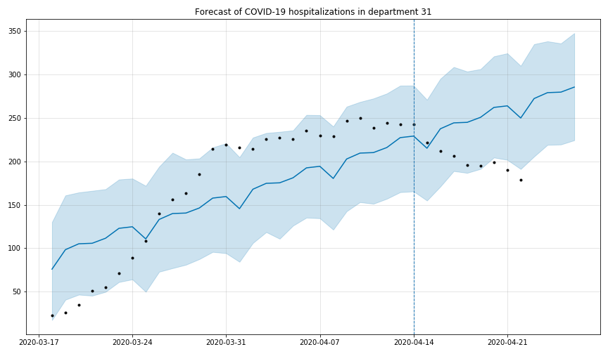

# Forecast of COVID-19 deaths and hospitalizations in France (last update: 11/04/2020)

Visualize a forecast of the evolution of the COVID-19 hospitalizations in a given French department + forecast of the total number of deaths

COVID-19 and geographical data come from the [French open data portal](https://www.data.gouv.fr/fr/)

Data are stored as [pandas](https://pandas.pydata.org/) / [GeoPandas](http://geopandas.org/) dataframes

Forecast of time series (number of hospitalizations per department) is realized with [Facebook Prophet](https://facebook.github.io/prophet/)

Graphical visualization is realized with matplotlib

Example: forecast of the number of COVID-19 hospitalizations in a French department

Example: forecast of the total number of (new) deaths in France

## Running the tests

Run the demo-hosp_dept notebook to build the forecast of hospitalizations on a specific department. Run the demo-death notebook to build a forecast of deaths in France.

## Built With

* [Prophet](https://facebook.github.io/prophet/) - Open source software (Facebook) for forecasting time series

* [pandas](https://pandas.pydata.org/) - Python Data Analysis Library

* [GeoPandas](http://geopandas.org/) - GeoPandas is an open source project which extends the datatypes used by pandas to allow spatial operations on geometric types. 

## Authors

* **Thomas Dubot** 

## License

This project is licensed under the MIT License - see the [LICENSE.md](LICENSE.md) file for details

## Acknowledgments

COVID-19 data are shared on the [French open data portal](https://www.data.gouv.fr/fr/)

More information here: https://www.data.gouv.fr/fr/datasets/donnees-relatives-a-lepidemie-du-covid-19/
